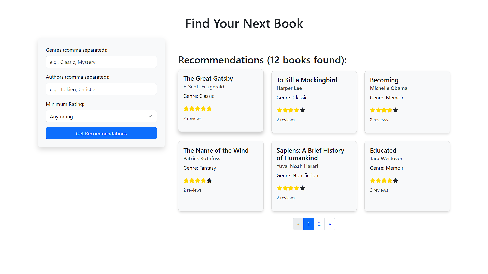

# Book Recommendation System 📚



A full-stack web application that provides personalized book recommendations using TypeScript, Express, MongoDB, and advanced search capabilities.

## 🛠️ Technologies Used

### Production Dependencies
- Express - Web application framework
- Mongoose  - MongoDB object modeling
- Body-parser  - Request body parsing
- Dotenv  - Environment configuration
- Fuse.js  - Fuzzy search implementation

### Development Dependencies
- TypeScript                       
- Jest (^29.0.0) with ts-jest
- Supertes
- Various TypeScript type definitions 

## 🚀 Project Setup

1. Clone the repository
2. Create `.env` file from `.env.example`
3. Configure MongoDB connection URL in `.env`
4. Install dependencies:
```
npm install
```
5. Build the project:
```
npm run build
```
6. Start the application:
```
npm start
```

## 📋 Implementation Details

### Backend Architecture
- Modular design with clear separation of concerns
- Service-oriented architecture pattern
- Type-safe implementation using TypeScript
- RESTful API design following best practices
- Custom middleware for request validation and error handling

### Database Design & MongoDB Integration
- Advanced data modeling with Mongoose schemas
- Efficient indexing strategies:
  - Compound indexes for frequently queried fields
  - Text indexes for full-text search capabilities
  - Geospatial indexes for location-based queries
- Optimized query patterns for performance

### Search & Recommendation Features
- Fuzzy Search Implementation:
  - Utilizes Fuse.js for flexible text matching
  - Configurable search parameters and weights
  - Handles typos and partial matches

- Recommendation Engine:
  - MongoDB aggregation pipelines for complex data processing
  - Multi-factor recommendation algorithm
  - User preference weighting system
  - Collaborative filtering capabilities

### Performance Optimizations
- Pagination Implementation:
  - Cursor-based pagination for large datasets
  - Configurable page sizes
  - Optimized for MongoDB performance

- Query Optimization:
  - Strategic use of MongoDB indexes
  - Efficient data retrieval patterns
  - Caching strategies for frequent queries

### Error Handling
- Comprehensive error management system
- Custom error classes for different scenarios
- Structured error responses
- Detailed logging implementation
- Request validation middleware

### Testing Framework
- Jest configuration for TypeScript
- Unit tests for business logic
- Integration tests for API endpoints
- Test coverage reporting
- Mocking utilities for external dependencies

### CI/CD Pipeline
- Automated testing with GitHub Actions
- Build verification steps
- Code quality checks
- Automated deployment process
- Environment-specific configurations

## 🔍 Advanced Features

### MongoDB Aggregation Framework
- Complex data transformations
- Multi-stage processing pipelines
- Statistical analysis capabilities
- Dynamic recommendation generation

### Search Optimization
- Intelligent text matching
- Relevance scoring
- Search result ranking
- Query performance optimization

### Data Processing
- Batch processing capabilities
- Stream processing for large datasets
- Data validation and sanitization
- ETL processes for book data

## 📈 Evaluation Criteria Met

1. Backend Architecture:
   - Clean, modular codebase
   - Type-safe implementation
   - RESTful design principles
   - Middleware architecture

2. MongoDB Proficiency:
   - Advanced querying techniques
   - Complex aggregation pipelines
   - Efficient data modeling
   - Index optimization

3. Recommendation Logic:
   - Multi-factor algorithm
   - Preference-based filtering
   - Relevance scoring
   - Performance optimization

4. Error Handling:
   - Comprehensive error management
   - Structured error responses
   - Validation middleware
   - Detailed logging

5. Performance:
   - Optimized queries
   - Efficient data retrieval
   - Caching strategies
   - Pagination implementation
